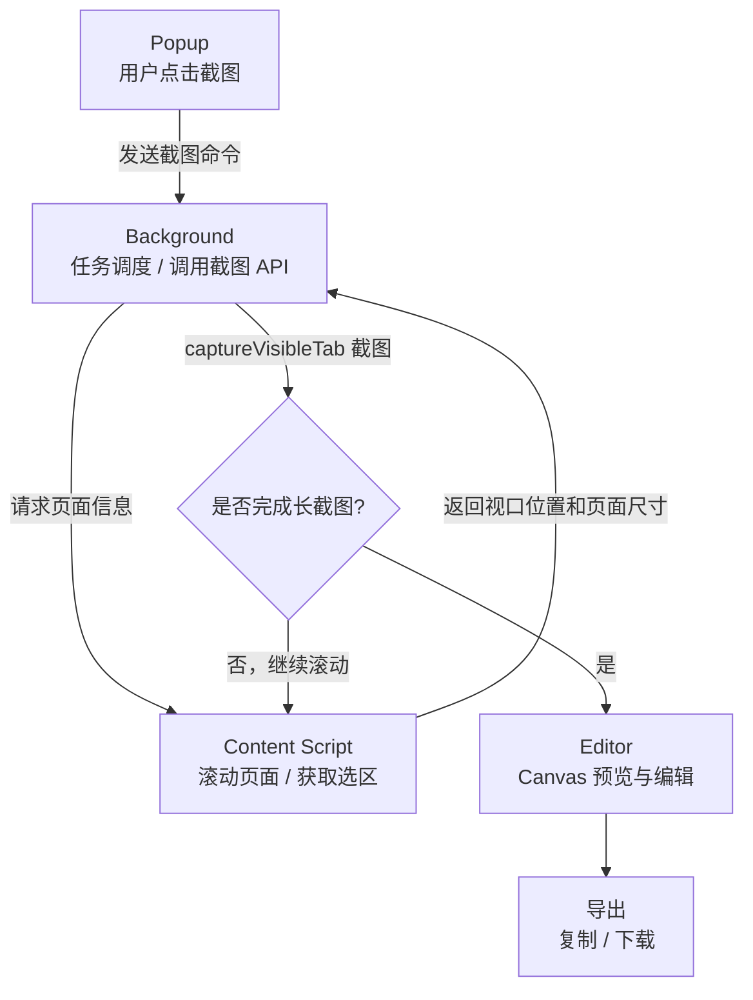

# ripfullpage

一个基于 Manifest V3 的原生 Chrome 截图扩展，支持全页截图、自定义区域截图、元素截图、滚动元素截图、截图编辑、复制、分享和多格式导出。

不使用任何框架或构建工具，直接加载项目根目录即可运行。兼容 Chrome、Edge、Brave 等 Chromium 内核浏览器。

## 预览


## 功能

- 全页截图：自动滚动页面并拼接完整截图。
- 自定义截图：拖拽选择当前可见区域进行截图。
- 元素截图：点击页面中的 DOM 元素，自动截取可见范围。
- 滚动元素截图：点击带内部滚动条的 DOM 元素，自动滚动并拼接该区域的完整内容。
- 延迟截图：支持 2、3、5 秒倒计时，适合截取 hover、菜单、弹层状态。
- 快捷键：`Alt+Shift+F` 全页截图，`Alt+Shift+S` 自定义截图。
- 截图编辑：支持裁剪、画笔、高亮、矩形、椭圆、箭头、文字、马赛克和贴图。
- 历史记录：保存最近截图缩略图，可从 popup 快速回到编辑器。
- 历史操作：编辑器内支持撤销、重做、重置。
- 复制/分享：支持一键复制到剪贴板，系统支持时可使用原生分享。
- 多格式导出：支持 PNG、JPG、WebP 和 PDF，JPG/WebP 可调质量。
- 尺寸显示：编辑器实时显示当前图片像素尺寸。
- 超长页面保护：对无限滚动或超长页面提供截图上限提示，避免浏览器卡死。
- 浮动元素处理：减少固定导航、悬浮按钮、广告、翻译浮球在全页截图中重复出现。
- 多语言基础：使用 Chrome 原生 `_locales` 支持中英文 manifest 文案。

## 安装

1. 下载或克隆本项目。
2. 打开 Chromium 浏览器扩展管理页：
   - Chrome: `chrome://extensions`
   - Edge: `edge://extensions`
   - Brave: `brave://extensions`
3. 开启“开发者模式”。
4. 点击“加载已解压的扩展程序”。
5. 选择本项目根目录。

## 使用

点击浏览器工具栏中的 ripfullpage 图标：

- `全页截图`：自动滚动并拼接页面截图，完成后进入编辑器。
- `自定义截图`：在页面上拖拽选择区域，松开后进入编辑器。
- `元素截图`：移动鼠标高亮页面元素，点击后截取该元素可见区域。
- `滚动元素截图`：移动鼠标到表格、弹窗内容区等带内部滚动条的区域，点击后拼接该滚动区域的完整内容。目标区域需要完整显示在当前浏览器窗口内。
- 对同源 iframe 内的老式系统页面，会将 iframe 文档视口作为滚动区域处理；跨域 iframe 受浏览器安全限制无法内部滚动截图。
- `延迟`：选择倒计时后再触发截图，便于手动展开菜单或保持 hover 状态。
- `最近截图`：点击缩略图可以重新打开历史截图进行编辑。

在编辑器中可以进行裁剪、标注、打码、贴图、撤销/重做，最后复制到剪贴板、下载图片、导出 PDF 或调用系统分享。

## 工作流程



## 项目结构

```text
.
├── manifest.json
├── _locales/
│   ├── en/
│   │   └── messages.json
│   └── zh_CN/
│       └── messages.json
├── icons/
│   ├── icon16.png
│   ├── icon48.png
│   └── icon128.png
├── shared/
│   └── constants.js           # 跨页面共享的存储键
├── background/
│   └── service_worker.js
├── content/
│   ├── content_runtime.js     # 翻译、toast、倒计时和等待工具
│   ├── content_selection.js   # 选区 UI 与滚动区域识别
│   ├── content_page_cleanup.js # 浮层、广告与聊天输入框清理
│   ├── content_capture.js     # 滚动、分块截图与图片拼接
│   ├── content_script.js      # 截图命令入口与错误处理
│   └── content_style.css
├── popup/
│   ├── popup.html
│   ├── popup.js
│   └── popup.css
├── editor/
│   ├── editor.html
│   ├── editor.js              # 编辑器状态与事件调度
│   ├── editor_bootstrap.js    # 启动错误和超时处理
│   ├── editor_geometry.js     # 坐标与裁剪计算
│   ├── editor_drawing.js      # 标注、隐私工具与 WASM 回退
│   ├── editor_watermark.js    # 水印绘制
│   ├── editor_export.js       # 图片、剪贴板与 PDF 导出
│   ├── editor.css
│   └── wasm_core.js
├── rust-core/                 # Rust/WASM 图像处理核心源码
└── wasm/
    └── ripfullpage_core.wasm
```

## 技术说明

- Manifest V3
- 原生 JavaScript / HTML / CSS
- Rust + WebAssembly 加速部分编辑能力，失败时回退到 Canvas 实现
- 无前端框架或打包工具，商店包直接由运行时文件组成
- 按需注入拆分后的 content runtime、选区、页面清理和截图流程模块
- 使用 `chrome.tabs.captureVisibleTab` 截图
- 使用 `chrome.storage.session` 在截图流程和编辑器之间传递图片数据
- 使用 `chrome.storage.local` 保存最近截图历史
- 使用 `commands` 注册浏览器快捷键

## 注意事项

- 浏览器内置页面无法截图，例如 `chrome://extensions`、Chrome Web Store、扩展页面等。
- 无限滚动页面没有稳定的“完整页面”终点，建议使用默认的限制截图模式。
- 超长页面截图会消耗较多内存和时间，完整截图前请确认页面规模。

## License

MIT
